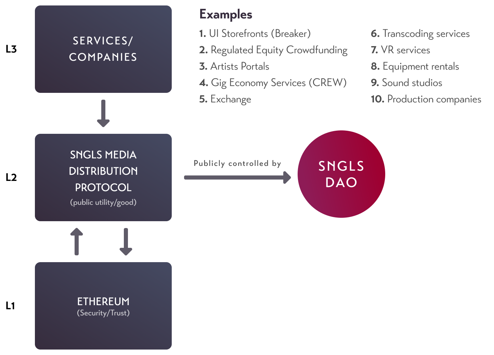
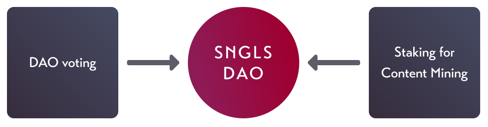
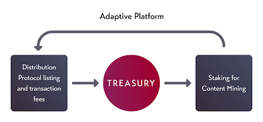
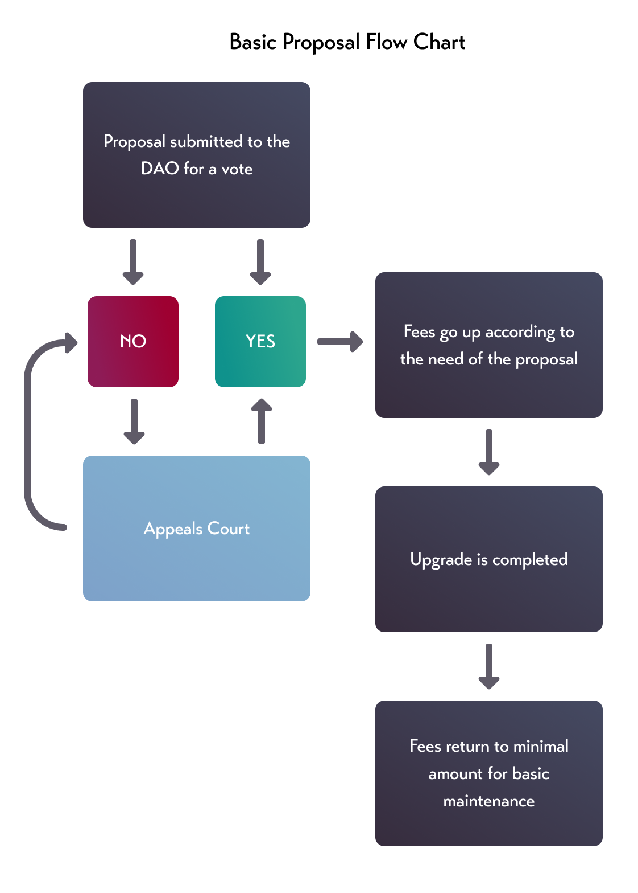
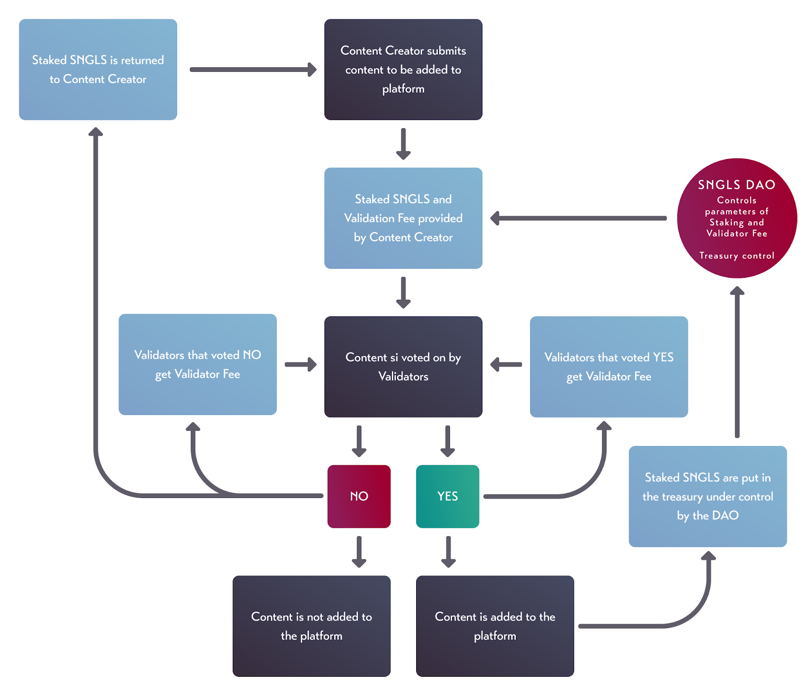
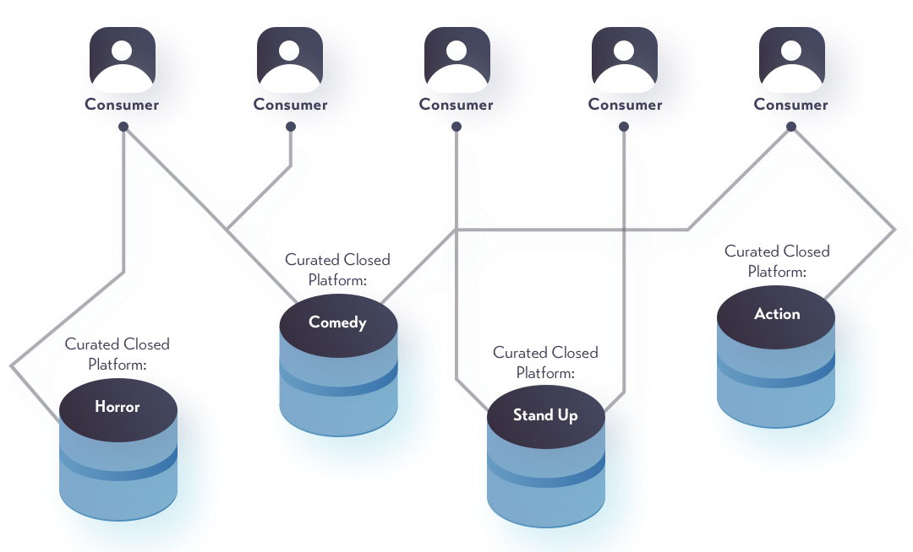
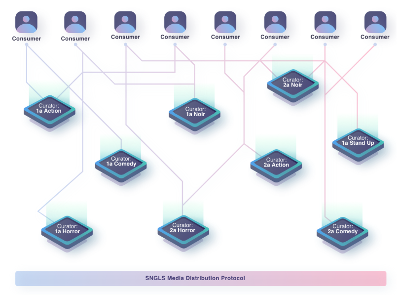

# SNGLS 2.0 White Paper

## A public decentralized entertainment P2P marketplace utility

**This Working White Paper is a draft and is intended for discussion and information purposes only.  It is being released in its current form in order to inspire spirited debate and allow time for our community to thoughtfully engage with a potential direction for our token.  No part of this Working White Paper is legally binding or enforceable against its authors, Breaker, its affiliates or their employees, nor is it meant to be.  It does not reflect the official position of Breaker at this time and should not be considered by anyone as a business plan or a promise to implement the ideas described herein.**
 
**Nothing in this Working White Paper shall be deemed to constitute a prospectus of any sort or a solicitation for investment, nor does it in any way pertain to an offer to sell or a solicitation of an offer to buy any securities in any jurisdiction at any time.**
 
**Please do not copy or disseminate any part of this Working White Paper without including this disclaimer.**
 
## Architects:
Milad Mostavi, Troy Murray and Zach LeBeau

## CONTENTS
### **I. Intro**

1. State of The Commons
2. Comparison between Bitcoin/Ethereum and Content Mining
3. Platform Manifesto

        a. We ask, “what can our platform do for content, not what content can do for our platform.”
4. The choice is up to the people
  
### **II. WEB3 Tech Stack**

### **III. SNGLS 2.0 Utility and Incentive Game**

1. Five Types of Participants
        
        a. Users (who buy and view content)
        b. Content Creators (who add new entries to the system)
        c. Validators
        d. Developers
        e. Third party service providers
    
### **IV. SNGLS DAO**

1. Adaptive Platform
2. Three Beginning Controls of the DAO on the Protocol
  
        a. Treasury Control
        b. Platform Parameter Settings
                - Validation Fee 
                - Listing Fee
                - Transaction Fee
        c. Forum for Proposals
                - Grants
       
### **V. Content Mining**

1. Mechanism
2. Flow of System

### **VI. Homepage Content Display**

  1. Token Curated Registry
  2. WEB2.0 - Traditional Siloed Curation
  3. WEB3.0 - Curation Marketplace
  
### **VII. Glossary

### **VIII. References**

**Words appearing in title case are defined in the glossary**

## I. INTRO
The commons: cultural resources accessible by all members of society

In our modern world the commons have been privatized into siloed architectures where large companies with shadowy equity holders can influence the discourse that could once flow freely over the networks.1  From the dark corners of the internet a force of light was released into the world using a trustless mechanism that removed the siloed architectures and gave the commons back to the people, a gift from an anonymous entity going by the name of Satoshi Nakamoto.2 Having different participants with alternative incentives that compete with each other in the system, they created a self-sustaining public currency that we call Bitcoin.  Breaker plans on using a similar self-sustaining mechanism to deliver a public media distribution utility.  We ask ourselves, not what content can do for our platform, but what can our platform do for content?  We don’t know the final outcome of this grand experiment.  All we can do is show you how it begins. Where it goes, is a choice left to you.

## II. WEB3 Tech Stack

Breaker: SNGLS 2.0 is built using the WEB3 Tech Stack:  

All the content purchases/rights will be registered on the Ethereum blockchain, which acts as the source of trust (L1). We will be birthing the platform (L2) into the world and offering services to be built on top of the utility.  The platform will be controlled by the SNGLS DAO (Decentralized Autonomous Organization).  Other companies can come into the space and offer services as well (L3).  

There are many different services that could come of this and we have only just started to scratch the surface of what these services could be.  We think this will ignite the decentralized entertainment economy and spur growth for services and new opportunities along with business models for artists.

## III. SNGLS 2.0 UTILITY AND INCENTIVE GAME

The native token of the ecosystem will be SNGLS.  The SNGLS token will be used in the DAO for voting rights to approve or deny proposals for upgrading the platform, amount for listing/upload fees, and Treasury control.  SNGLS will also be stakeable in the Content Mining operation which will decide what gets listed on the platform and what doesn’t.

In our system we have five participants with different incentives for the mechanism to achieve equilibrium (in no particular order):
1. Users:  the people who buy and view content
2. Content Creators: the people who add new entries to the system
3. Validators: Entities that vote on content being added or not to the system
4. Developers: The plumbers who keep the platform running
5. Third party service providers: Companies that derive their income from the platform by providing a service to the Content Creators

We took a lot of inspiration from the Bitcoin community and how the different players of User, merchants, miners, Developers, and exchanges all come together under one incentive game to keep the system running.  

The incentives play the participants off each other by making them want the system to be the best:
1. New content has to be validated into the system (very much how new transactions have to be mined onto the blockchain in Bitcoin or Ethereum).
2. Validators stake a minimum number of SNGLS, the more SNGLS they stake the higher their vote is in determining what gets validated onto the platform.  They are rewarded for their work and penalized for their mistakes.
3. Developers can get Grants through the DAO.
4. Third party services can provide paid services to the Content Creators.

## IV. SNGLS DAO
Our goal is to create a “living” system that adapts the platform (Breaker DApp) to the needs of the artists, without living on the backs of the creators. 

### Adaptive Platform Rules 
1. Fees are kept low for basic maintenance
   
       a. Not operating on the back of creators, i.e. wealth extraction
2. Fees increase for upgrades and retreat when finished

The SNGLS DAO framework is designed so that it starts as a simple kernel that can grow, or decrease, in complexity according to the needs of the platform determined by the community. The DAO will have three controls from the start.

### 3 Original DAO Controls
1. **Forum for proposals:** The forum is a place where proposals to the platform are submitted. They will be voted on by the DAO. Funds and fees will be allocated according to the proposal.
2. **SNGLS Media Distribution Protocol parameter settings:** The Staking and Transaction Fees are allocated to the Treasury of the DAO. A Validation Fee is paid to the Validators.  All parameters are voted on and set by the DAO.
                 
       a. Validation Fee: Minimum amount paid to curators
       b. Listing Fee: The minimum amount of SNGLS needed to be staked to have content mined onto the platform
       c. Transaction Fee: The percentage taken on every transaction of a rented or purchased piece of content
3. **Treasury Control:** The Treasury will collect a minimal amount of fees so general maintenance to the platform can be had.  If a large upgrade is submitted to the forum and is accepted the fees will increase until enough capital has been allocated for a successful build out.

## V. CONTENT MINING

One of the biggest problems in the technology sector right now is figuring out how to scale open content distribution platforms. The current systems are not able to keep up with the number of User that are coming onto these platforms and they end up banning large swaths of Content Creators even if they have done nothing wrong.3 Digging even deeper you have the problem of silencing voices of artists that could be against the regime of a country.4,5  Our solution to this is allowing humanity to validate its own artistic culture and history through a mechanism we call “Content Mining”.

Content Mining is designed to allow SNGLS holders to decide what kind of content they want to see included on the system.  It’s not “censorship-resistant or neutral” on purpose, but it does result in a validated content marketplace.  This is incredibly powerful, as it gives the public a tool to decide what it culturally thinks is correct.  This might sound scary to some people, but we believe that it is paramount to our mission.

### The basic content validation flow works like this:
1. The content creator prepares a new entry to the system. In order for the content to be submitted, some amount of SNGLS needs to be staked along with the Validation Fee.
    
       a. Validator Fees incentivize Validators to verify the content faster.
2. If the Validator fees are market correct, Validators will start verifying the content and they can vote up or down the entry.

       a. The more SNGLS a validator has staked, the more their vote counts.
       b. Once the threshold has been met the content is “mined” onto the platform.
3. Once the voting is done, no matter if the entry was accepted or not, the Validators are rewarded the fee proportional to their voting weight.

       a. If content is rejected the Content Creators are returned their initial SNGLS stake (Listing Fee).
             - If the Validator voted no (reject) then they are rewarded the validator fees, and the Validators that voted yes (accept) are rewarded nothing.
       b. If the content is accepted the initial SNGLS stake (Listing Fee) is sent to the Treasury that is controlled by the DAO.
             - If the Validator voted yes (accept) they are rewarded the Validation Fees, and the Validators that voted no (reject) are rewarded nothing.

In the event a piece of content is accepted into the system that is deemed not to be appropriate (ie copyrighted), the Validators will need to vote it out of the system.  When the content is voted off the system the original curators that voted “yes” will be penalized and lose their rewarded SNGLS payment. 

 

## VI. HOMEPAGE CONTENT DISPLAY (CURATED STOREFRONTS)

There is a lot of work that goes into curating lists for distribution portals.  Looking at the recent success of Shudder and Crunchy Roll, we can see that specific niche portals can have success.6,7 The problem is, once Netflix gets into their niche they have a hard time competing against it. Case in point would be Fandor or Seeso, as soon as Netflix started to offer their specific niche, people just decided it was cheaper to go with Netflix. Seeso saw a dramatic decline in User once Netflix started to release comedy stand-up specials, and was forced to close.8

Our solution is to turn curation into a marketplace using Token-Curated Registries (TCR). This way we split the system up allowing market forces to find the best curation according to the user. Curators will compete and collaborate for top spots in a user-curated experience and be rewarded on the backend. TCRs could charge a small fee for a subscription or add a fee every time someone watches a product it recommended. This should give birth to a new and exciting ecosystem that responds to User in ways not thought possible till now.   

### WEB2.0 Traditional Siloed Curation

In the traditional Web2.0 model you have businesses that handle all the costs of building a platform along with the overhead of maintaining them. The platforms attract User by curating a niche selection of content. The cost of all this is then extracted from the artists at the price of around 20-30%. Users also need to pay for each platform, which leads to platform fatigue and gives Netflix or the other big guys an easy data tool to see which markets they need to move into, allowing them to squash competition. 

### WEB3.0 - Curation Marketplace

In the WEB3 Curation Marketplace model we distill the entire ecosystem.  The platform is a base layer that is updated to the needs of the system, keeping overhead low and not extracting wealth from the artists as we covered in the DAO section.  The curation of content happens on the second layer and is a marketplace for curators to compete with each other, thus using market forces to create the best curation according to the User.

## VII. Glossary
1. Breaker DApp: A high end content portal that sits on top of the SNGLS media distribution protocol. Handles the processes that need a legal entity for the traditional Hollywood world and banking system charging a 20% service fee.
2. SNGLS Media Distribution Protocol: A trustless global media distribution protocol anyone can come in and build on top of spurring a decentralized entertainment economy, controlled by the SNGLS DAO.
3. Tech Stack: A set of software that provides the infrastructure for a technology system.
4. Token Utility: A set of roles the token has in a specific tokenized ecosystem.
5. Incentive Game: A payoff provided as a reward for a person in some activity which does not directly provide them with benefit.  
6. Users: Content consumers who use the platform.
7. Validators: Entities that vote on content being added, blocked, or removed from the platform.
8. Content creator: Entities that create content for the platform, i.e. artists 
9. Developers: Programers that maintain the platform. 
10. Third party service providers: Any service that is built on top of the distribution portal.
11. Adaptive platform: A platform that adapts to the needs of the system organically through the DAO. 
12. Decentralized Autonomous Organization (DAO): Organization represented by rules encoded as a computer program that is transparent and controlled by stakeholders.
13. Treasury: Repository where the Transaction Fees and SNGLS that are from Staking for curation are stored and controlled by the DAO.
14. Validation Fee: Minimum amount paid to curators to vote yes or no on a piece of content.
15. Listing Fee: The amount of the SNGLS needed to stake to potentially mine the content onto the platform.
16. Transaction Fee: The percentage taken on every transaction of a rented or purchased piece of content.
17. Grants: Capital allocated from the SNGLS DAO Treasury to proposals for development.
18. Platform Upgrade Proposals: Upgrades to the distribution portal that are voted on by the DAO.
19. Content Mining: A mechanism that incentivizes multiple parties to come together and decide what content should be allowed on platform.
20. Staking: The process by which a content creator will put their tokens up for voting for the content to be allowed on the platform or not.
21. Token Curated Registries: An incentivized voting game that helps create trusted lists that are maintained by the very people that use them.
22. Peer2Peer (P2P): A computer system where all “peers” are connected to each other via the Internet.  Files can be shared directly between systems on the network without the need for a central server.

## VIII. References
NBC News - Twitter pulls down bot network that pushed proSaudi talking points about disappeared journalist, https://www.nbcnews.com/tech/tech-news/exclusive-twitter-pulls-down-bot-network-pushing-pro-saudi-talking-n921871

Bitcoin.org - Bitcoin Whitepaper, https://bitcoin.org/bitcoin.pdf

Gizmodo - Twitter CEO Jack Dorsey: I Suck and the Problem Is the Whole Site, https://gizmodo.com/twitter-ceo-jack-dorsey-i-suck-and-the-problem-is-the-1832578727

The Daily Collegian - Youtube’s free speech problem, https://dailycollegian.com/2018/01/youtubes-free-speech-problem/

Free Press Journal - Delhi High court orders YouTube to take down PewDiePie videos targeting T-Series and India, https://www.freepressjournal.in/entertainment/sc-orders-youtube-to-take-down-pewdipie-videos-targeting-t-series-and-india/1501338

Pymnts - How Horror-Specific Streaming Service Shudder Connects Fans With Frights, https://www.pymnts.com/subscription-commerce/2018/shudder-horror-movie-streaming-service-netflix-hulu/

Polygon - Cruchyroll’s million-subscriber milestone proves anime streaming isn’t just niche, https://www.polygon.com/2017/2/10/14567090/crunchyroll-subscriber-count-2017

LA Times - Comedy streaming service Seeso shutting down after less than two years, https://www.latimes.com/business/hollywood/la-fi-ct-seeso-shutdown-20170809-story.html

Distractify - Is Swedish YouTuber PewDiePie Really Quitting YouTube, https://www.distractify.com/p/pewdiepie-leaving-youtube
